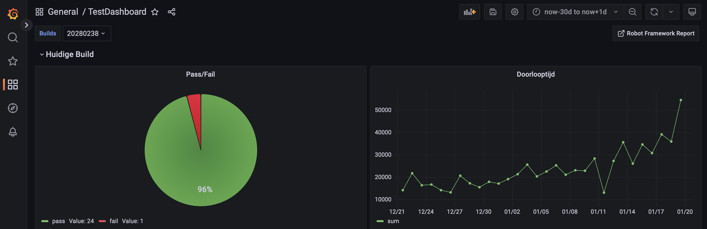
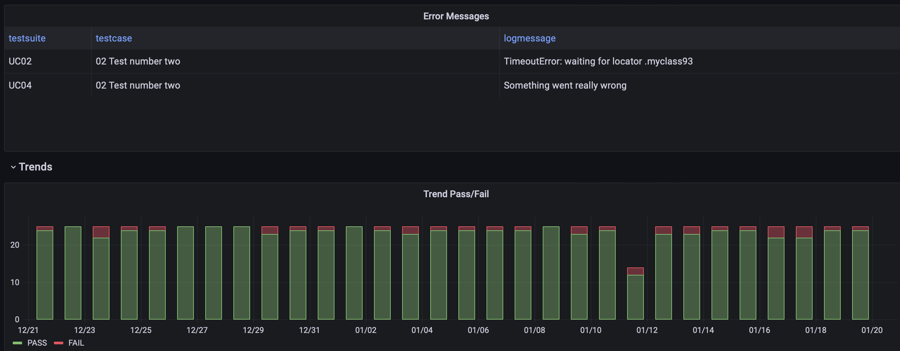
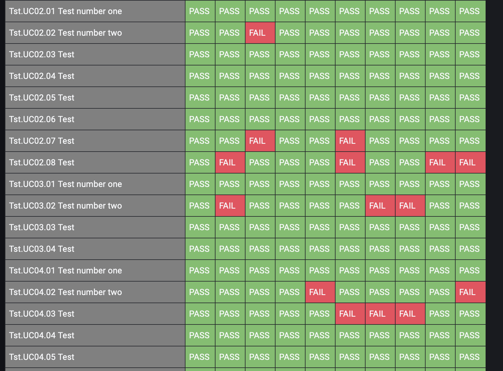

# testresults-dashboard-demo

## Goal

Create an infrastructure on a local kubernetes in which to generate testresults in order to be able to do a live demo how those results can be represented on a dashboard.

* Passing testcases
* Flaky testcases
* TestSuite with testcases that aren't run once in a while
* Execution time that increases over time





## Setup

Instruction are for running this demo on a Mac using [Minikube](https://minikube.sigs.k8s.io/docs/)

### Requirements

* [Homebrew](https://brew.sh) (already installed)
* [Podman](https://podman.io)
* [Minikube](https://minikube.sigs.k8s.io/docs/)
* [Robotframework](https://robotframework.org/)
* [TestArchiver](https://github.com/salabs/TestArchiver)
* [PostgreSQL](https://www.postgresql.org)
* [Grafana](https://grafana.com/)

#### Podman

``` bash
brew install podman
podman machine init --cpus 2
```

#### Minikube

``` bash
brew install minikube

minikube start \
--driver=podman \
--container-runtime=containerd \
--insecure-registry "10.0.0.0/24" \
--cni=auto

minikube addons enable registry
```

`--insecure-registry "10.0.0.0/24"` to enable pulling images from minikube registry

`--cni=auto` to enable networking to work

#### Containers

* PostgreSQL
  * [postgres.yaml](/infrastructure/k8s/postgres.yaml)
  * For more info: [github](https://github.com/docker-library/docs/blob/master/postgres/README.md)
* Grafana
  * [grafana.yaml](/infrastructure/k8s/grafana.yaml)
  * For more info: [grafana with docker](https://grafana.com/docs/grafana/latest/setup-grafana/installation/docker/)
* Robotframework and TestArchiver
  * [robotframework.yaml](/infrastructure/k8s/robotframework.yaml)
  * [Dockerfile](/infrastructure/robotframework-container/Dockerfile)
  * For more info:
    * [robotframework.org](https://robotframework.org)
    * [TestArchiver @ github](https://github.com/salabs/TestArchiver)

To build the image for robotframework run

``` bash
minikube image build -t localhost:5000/robotframework:latest .
minikube image push localhost:5000/robotframework:latest
```

Apply all manifests

``` bash
sh deploy.sh
```

or

``` bash
kubectl apply -f namespace.yaml
kubectl apply -f postgres-secret.yaml
kubectl apply -f postgres-db-config.yaml
kubectl apply -f postgres.yaml
kubectl apply -f grafana.yaml
kubectl apply -f robotframework.yaml
```

Opening the services to access reports and grafana (in separate shells):

``` bash
minikube service rf-database -n rf-dashboard-demo --url
minikube service robotframework -n rf-dashboard-demo --url
minikube service rf-dashboard -n rf-dashboard-demo
```

Attach to the robotframework pod and run the script `generate-testresults.sh` and wait for it to finish. (services must be opened as described above, or dns lookups will fail)

To open the standard generated robotframework reports:
`http://localhost:<portnr>/<buildnr>/report.html`
To open first build:
`http://localhost:<portnr>/20280209/report.html`

### Grafana

The [grafana-dashboard.json](/grafana-dashboard.json) can be imported, the queries used are explaned here.

Steps to get it all up and running:

1. Create a Datasource (Postgres) with the url to the rf-database service
    1. use the command `echo <postgres-secret> | base64 -d` to get the password to fill in
1. Create a new dashboard
    1. Check the json of that dasbhoard and check the new uid for the datasource
    1. Replace all instances of the old `uid` value in [grafana-dashboard.json](/grafana-dashboard.json) with the new value.
    1. Import [grafana-dashboard.json](/grafana-dashboard.json) as a new dashboard.

```json
          "datasource": {
            "type": "postgres",
            "uid": "h5H0Ytc4z"
```

Make sure you run the following sql statement (either from a dbclient or in a query field in grafana) otherwise the
flakyness table will be empty.

```sql
 CREATE EXTENSION tablefunc;
```

### Variables

`buildnr` should be created

```sql
select distinct build_id from test_series_mapping tsm
```

### Pass/Fail

```sql
select count(status) as PASS from
    (select s.status from test_result s
    join test_series_mapping m on m.test_run_id = s.test_run_id
    join test_series ts on ts.id = m.series
    where status = 'PASS' and m.build_id = '${buildnr}' ) AS derived_table
```

### Errors

```sql
SELECT s.name as TestSuite, tc.name as TestCase, lm.message as LogMessage
FROM test_series_mapping tsm
JOIN test_run tr ON tsm.test_run_id = tr.id
JOIN test_result tres ON tr.id = tres.test_run_id
JOIN test_case tc ON tres.test_id = tc.id
JOIN suite s ON tc.suite_id = s.id
JOIN log_message lm ON tres.test_id = lm.test_id AND tsm.test_run_id = lm.test_run_id
WHERE
               tres.status = 'FAIL' and
               tsm.build_id = '${buildnr}' and
               lm.log_level = 'FAIL'

SELECT tc.name as TestCase, lm.message as LogMessage
FROM test_series_mapping tsm
    JOIN test_run tr ON tsm.test_run_id = tr.id
    JOIN test_result tres ON tr.id = tres.test_run_id
    JOIN test_case tc ON tres.test_id = tc.id
    JOIN log_message lm ON tres.test_id = lm.test_id AND tsm.test_run_id = lm.test_run_id
WHERE
   tres.status = 'FAIL' and
   tsm.build_id = '${buildnr}' and
   lm.log_level = 'FAIL'
```

### Trend #testcases run per build

```sql
SELECT
  $__timeGroupAlias(generated,$__interval),
  count(tc.id) AS "#testcases"
FROM test_run tr
    JOIN test_result tres ON tr.id = tres.test_run_id
    JOIN test_case tc ON tres.test_id = tc.id
WHERE
  $__timeFilter(generated)
GROUP BY 1
ORDER BY 1
```

### Trend Pass/Fail over time

```sql
SELECT
  $__timeGroupAlias(generated,$__interval),
  count(tres.status) AS "PASS"
FROM test_run tr
    JOIN test_result tres ON tr.id = tres.test_run_id
    JOIN test_case tc ON tres.test_id = tc.id
WHERE
  $__timeFilter(generated) AND
  tres.status = 'PASS'
GROUP BY 1
ORDER BY 1
```

### Flakyness

```sql
SELECT *
FROM crosstab('SELECT tc.full_name, trus.test_run_id, execution_status
FROM test_result trus
JOIN test_series_mapping tsm ON trus.test_run_id = tsm.test_run_id
JOIN test_run trun ON trus.test_run_id = trun.id
JOIN test_case tc ON trus.test_id = tc.id
WHERE tsm.series = 1 AND trus.test_run_id > (SELECT MAX(test_run_id) FROM test_result)-10
order by 1,2
')
  AS final_result(TestID text, a text, b text, c text, d text, e text, f text, g text, h text, i text, j text);
```

## Acknowledgements
In the need to represent the results, an initial dashboard has been developed on which this is loosely based. 

Thanks to
[@bennyvw](https://github.com/bennyvw)